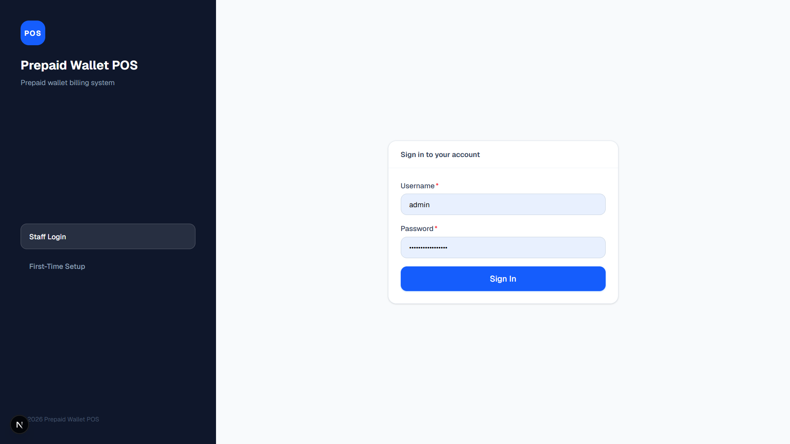
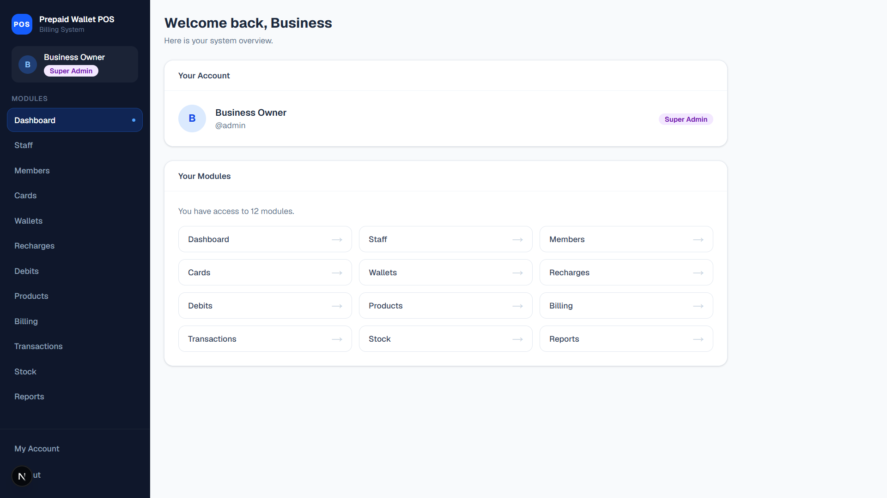
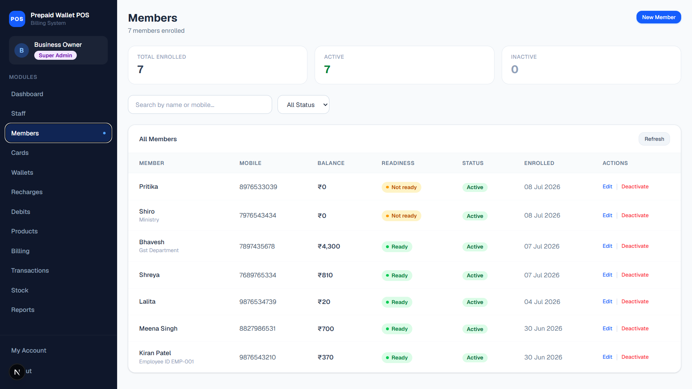
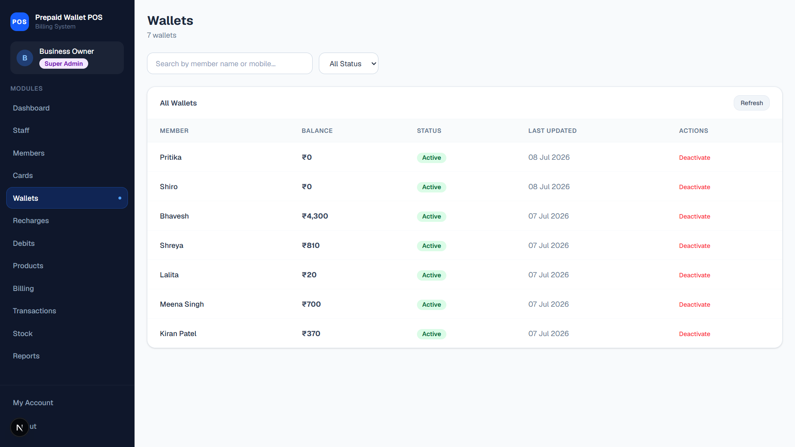
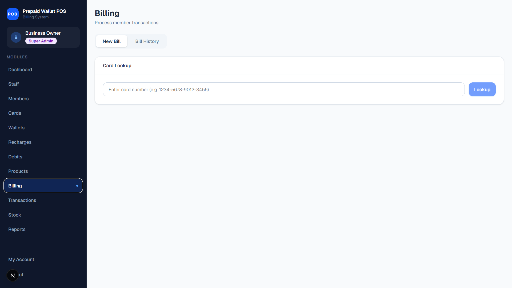
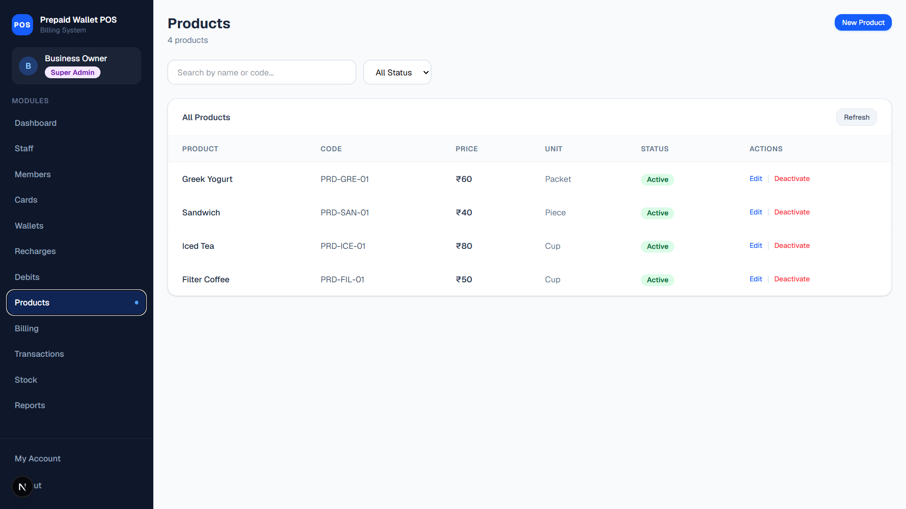
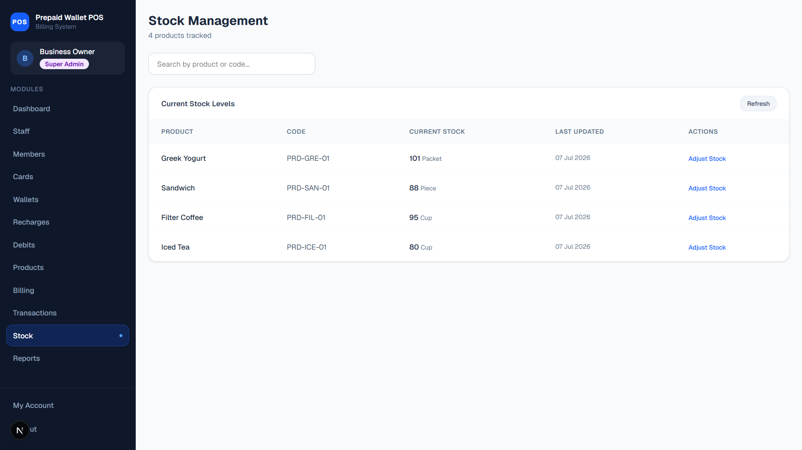
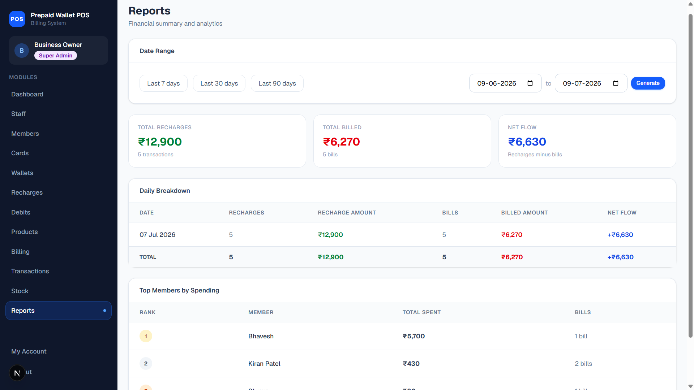

# Prepaid Wallet POS System

A modern, secure, and scalable **Prepaid Wallet Point of Sale (POS)** system built with **Next.js**, **TypeScript**, and **MongoDB**. The application enables businesses to manage members, prepaid wallets, cards, inventory, billing, and financial transactions from a single platform.

Designed as an internal business application, the system streamlines prepaid wallet operations while ensuring secure authentication, accurate inventory management, and complete financial traceability.

---

## 🌐 Live Demo

**Application:** https://prepaid-wallet-pos.vercel.app/

---

##  Table of Contents

- Project Overview
- Features
- Business Workflow
- Technology Stack
- System Architecture
- Core Modules
- Folder Structure
- Getting Started
- Environment Variables
- Running the Project
- Build & Deployment
- Security
- Future Enhancements
- License

---

#  Project Overview

The **Prepaid Wallet POS System** replaces traditional cash-based billing with a secure prepaid wallet ecosystem.

Each registered member receives a digital wallet that can be recharged by authorized staff. During billing, purchases are deducted directly from the member's wallet balance while inventory is updated automatically.

The application combines customer management, wallet management, inventory, billing, reporting, and authentication into a single full-stack solution.

---

#  Features

## Authentication

- JWT Authentication
- Secure Login
- Role-Based Access Control
- Protected Routes
- First-Time System Setup

---

## Dashboard

- Business Overview
- Summary Cards
- Quick Navigation
- Operational Statistics

---

## Staff Management

- Create Staff
- Update Staff
- Activate / Deactivate Staff
- Secure Password Management

---

## Member Management

- Register Members
- Edit Member Details
- Member Search
- Member Status Management

---

## Card Management

- Card Registration
- Card Assignment
- Card Status Management
- Card Replacement Support

---

## Wallet Management

- Wallet Creation
- Wallet Balance
- Recharge Wallet
- Manual Debit
- Wallet History

---

## Billing

- Product Selection
- Wallet Verification
- Automatic Wallet Deduction
- Automatic Stock Reduction
- Transaction Recording

---

## Inventory

- Product Management
- Stock Management
- Stock History
- Inventory Validation

---

## Reports

- Sales Reports
- Wallet Reports
- Member Reports
- Inventory Reports
- Transaction Reports

---

#  Business Workflow

```text
Administrator Login
        │
        ▼
Create Staff
        │
        ▼
Create Products
        │
        ▼
Add Stock
        │
        ▼
Register Member
        │
        ▼
Assign Card
        │
        ▼
Create Wallet
        │
        ▼
Recharge Wallet
        │
        ▼
Billing
        │
        ▼
Wallet Deduction
        │
        ▼
Stock Reduction
        │
        ▼
Transaction History
        │
        ▼
Reports
```

---

#  Technology Stack

## Frontend

- Next.js
- React
- TypeScript
- Tailwind CSS

---

## Backend

- Next.js API Routes
- Node.js

---

## Database

- MongoDB
- Mongoose

---

## Authentication

- JWT
- bcryptjs

---

## Development Tools

- ESLint
- TypeScript
- npm

---

# 🏗 System Architecture

```
                Client
                   │
                   ▼
        Next.js Frontend (React)
                   │
                   ▼
          API Routes (Backend)
                   │
                   ▼
          Service Layer
                   │
                   ▼
          MongoDB Database
```

---

#  Core Modules

- Authentication
- Dashboard
- Staff
- Members
- Cards
- Wallets
- Recharges
- Debits
- Products
- Stock
- Billing
- Transactions
- Reports
- Account

---

# 📁 Project Structure

```text
prepaid-wallet-pos/
│
├── docs/                  # Project documentation
│   └── PRD.md
│
├── public/                # Static assets
│
├── src/
│   ├── app/               # App Router pages & API routes
│   ├── components/        # Reusable UI components
│   ├── features/          # Feature-based business modules
│   ├── layouts/           # Layout components
│   ├── lib/               # Shared utilities & configuration
│   ├── middleware/        # Authentication middleware
│   ├── models/            # MongoDB models
│   ├── services/          # Business logic
│   ├── repositories/      # Database access layer
│   ├── hooks/             # Custom React hooks
│   ├── types/             # TypeScript definitions
│   ├── utils/             # Utility functions
│   └── constants/         # Application constants
│
├── .env.example
├── package.json
├── README.md
└── tsconfig.json
```

---

# ⚙️ Prerequisites

Before running the project, ensure the following are installed:

- Node.js 20+
- npm
- MongoDB (Local or Atlas)
- Git

---

#  Getting Started

## 1. Clone the Repository

```bash
git clone <repository-url>
```

---

## 2. Navigate to the Project

```bash
cd prepaid-wallet-pos
```

---

## 3. Install Dependencies

```bash
npm install
```

---

## 4. Configure Environment Variables

Create a new file:

```text
.env.local
```

Copy the contents of:

```text
.env.example
```

Update the values according to your environment.

Example:

```env
MONGODB_URI=your_mongodb_connection_string

JWT_SECRET=your_secret_key

JWT_EXPIRES_IN=7d

NODE_ENV=development
```

---

# ▶ Running the Application

Start the development server:

```bash
npm run dev
```

Open:

```
http://localhost:3000
```

---

# 🏗 Production Build

Create a production build:

```bash
npm run build
```

Run the production server:

```bash
npm start
```

---

#  Available Scripts

| Command | Description |
|----------|-------------|
| npm run dev | Start development server |
| npm run build | Create production build |
| npm start | Run production server |
| npm run lint | Run ESLint |

---

#  Deployment

The application is optimized for deployment on **Vercel**.

Deployment steps:

1. Push the project to GitHub.
2. Import the repository into Vercel.
3. Configure environment variables.
4. Deploy the application.

---

#  Security Features

The application includes several security mechanisms:

- JWT Authentication
- Password Hashing using bcrypt
- Protected Routes
- Role-Based Access Control (RBAC)
- Secure API Validation
- Environment Variable Configuration
- Input Validation
- Authentication Middleware

---

#  Core Business Workflow

```text
Login
   │
   ▼
Dashboard
   │
   ▼
Members
   │
   ▼
Cards
   │
   ▼
Wallets
   │
   ▼
Recharge
   │
   ▼
Billing
   │
   ▼
Wallet Deduction
   │
   ▼
Stock Update
   │
   ▼
Transaction
   │
   ▼
Reports
```

---

#  API Overview

The application exposes RESTful API endpoints for core business operations.

### Authentication

- Login
- Logout
- Setup
- Session Validation

---

### Staff

- Create Staff
- Update Staff
- View Staff
- Delete / Deactivate Staff

---

### Members

- Register Member
- Update Member
- Search Member
- View Member

---

### Cards

- Create Card
- Assign Card
- Update Card
- View Card

---

### Wallets

- Create Wallet
- Recharge Wallet
- Debit Wallet
- Wallet Balance
- Wallet History

---

### Products

- Create Product
- Update Product
- View Products

---

### Stock

- Add Stock
- Update Stock
- View Inventory

---

### Billing

- Create Bill
- View Bills
- Billing History

---

### Reports

- Sales Reports
- Wallet Reports
- Transaction Reports
- Inventory Reports

---

#  Screenshots

### Login



---

### Dashboard



---

### Member Management



---

### Wallet Management



---

### Billing (POS)



---

### Product Management



---

### Stock Management



---

### Reports



---

# 🎯 Design Principles

The application has been designed around the following principles:

- Modular Architecture
- Clean User Interface
- Reusable Components
- Separation of Concerns
- Secure Authentication
- Business Rule Enforcement
- Financial Data Integrity
- Inventory Consistency
- Scalable Feature-Based Structure

---

# 💡 Future Enhancements

Potential improvements for future versions include:

- QR Code-Based Billing
- Barcode Scanner Integration
- Online Wallet Recharge
- Email Notifications
- SMS Notifications
- Receipt Printing
- Customer Portal
- Mobile Application (Android & iOS)
- Multi-Branch Support
- Advanced Analytics Dashboard
- Backup & Restore Module
- Audit Logs
- Export Reports (PDF/Excel)

---

# 🤝 Contributing

Contributions are welcome.

If you would like to contribute:

1. Fork the repository.
2. Create a feature branch.

```bash
git checkout -b feature/new-feature
```

3. Commit your changes.

```bash
git commit -m "Add new feature"
```

4. Push the branch.

```bash
git push origin feature/new-feature
```

5. Open a Pull Request.

---

# 📈 Project Highlights

- Full-Stack Next.js Application
- TypeScript Throughout the Project
- JWT Authentication
- MongoDB Integration
- Role-Based Access Control
- Secure Password Hashing
- Feature-Based Architecture
- Wallet-Based Payment System
- Inventory Management
- Billing & POS
- Financial Transaction Tracking
- Comprehensive Reporting
- Responsive User Interface

---

# 📋 Development Practices

This project follows modern software engineering practices including:

- Feature-Based Folder Structure
- Service Layer Architecture
- Repository Pattern
- TypeScript Type Safety
- Environment-Based Configuration
- Reusable Components
- API Separation
- Business Logic Encapsulation

---

# 📚 Documentation

Project documentation is available in the `docs` directory.

- **PRD.md** – Product Requirements Document
- Additional technical documentation can be added as the project evolves.

---


---

# 👨‍💻 Author

**Laxmi Godara**

Full Stack Developer

---

# 🌟 Acknowledgements

Built using:

- Next.js
- React
- TypeScript
- MongoDB
- Mongoose
- Tailwind CSS
- JWT
- bcryptjs

---


# 📬 Contact

For questions, suggestions, or collaboration opportunities, feel free to connect through GitHub.

---

## Final Notes

The **Prepaid Wallet POS System** is a production-oriented business application developed to simplify prepaid wallet operations through secure authentication, efficient member management, automated inventory control, wallet-based billing, and comprehensive financial reporting.

The application demonstrates modern full-stack development practices using **Next.js**, **TypeScript**, **MongoDB**, and a feature-based architecture, making it suitable for real-world business environments and as a showcase project for professional portfolios.
